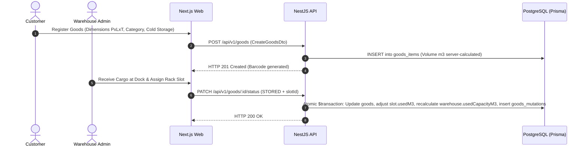
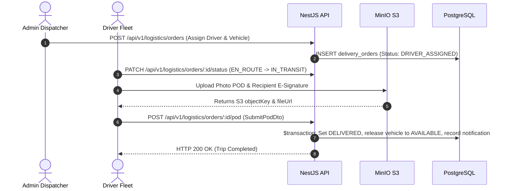

# System Architecture & Topology Overview
**Warehouse Management System (WMS Nusantara)**
*High-Level Enterprise Architecture, Monorepo Topology, and Multi-Client Interaction*

---

## 1. System Overview & Vision

**WMS Nusantara** adalah platform tata kelola pergudangan dan logistik rantai dingin (*Cold Chain Logistics*) modern yang menghubungkan operasional gudang, tenant/pelanggan mandiri, dan armada distribusi dalam satu sistem terintegrasi.

```text
┌─────────────────────────────────────────────────────────────────────────────┐
│                          CLIENT APPLICATION TIER                            │
│                                                                             │
│   ┌───────────────────────────┐                 ┌───────────────────────────┐│
│   │    Next.js 15 Web App     │                 │   Kotlin Android Mobile   ││
│   │ (Admin, Customer, Driver) │                 │   (Driver Field App)      ││
│   │    [Port 3000 / HTTPS]    │                 │   [Future Mobile Repo]    ││
│   └─────────────┬─────────────┘                 └─────────────┬─────────────┘│
└─────────────────┼─────────────────────────────────────────────┼──────────────┘
                  │                                             │
                  │        HTTPS / RESTful JSON API             │
                  │        Authorization: Bearer <JWT>          │
                  │        X-Request-ID Header Echo             │
                  ▼                                             ▼
┌─────────────────────────────────────────────────────────────────────────────┐
│                       WMS BACKEND API GATEWAY (Port 5000)                   │
│                                                                             │
│  • Global Prefix: /api/v1 (Excluded: /health/*)                             │
│  • Security Layer: Helmet, CORS Whitelist, Rate Limiter                     │
│  • Auth Pipeline: JwtAuthGuard, RolesGuard (@Roles: ADMIN, CUSTOMER, DRIVER)│
│  • Interceptors: LoggingInterceptor (x-request-id), TransformResponse       │
│  • Exception Filter: GlobalExceptionFilter (Prisma P2002/P2025/P2003 map)   │
│  • 10 Core Modules: Auth, Users, Warehouses, Goods, Logistics, Billing,     │
│    Telemetry, Analytics, Notifications, Health                              │
└──────────────────────────────────────┬──────────────────────────────────────┘
                                       │
                    ┌──────────────────┴──────────────────┐
                    │                                     │
                    ▼                                     ▼
┌──────────────────────────────────────┐ ┌──────────────────────────────────────┐
│        POSTGRESQL 16 DATABASE        │ │      MINIO S3 OBJECT STORAGE         │
│         [Port 5432 / TCP]            │ │       [Port 9000 / HTTP(S)]          │
│                                      │ │                                      │
│ • Prisma ORM 6.x Data Layer          │ │ • Bucket: wms-storage                │
│ • 15 Relational Entities             │ │ • Digital POD Cargo Photos           │
│ • 14 Domain Enums                    │ │ • Customer Payment Transfer Proofs   │
│ • ACID Atomic Transactions           │ │ • Driver E-Signatures                │
└──────────────────────────────────────┘ └──────────────────────────────────────┘
```

---

## 2. Monorepo Structure

```text
Warehouse/
│
├── backend/                              # NestJS 10.x API Gateway & Service (Port 5000)
│   ├── src/
│   │   ├── common/                       # Guards, Interceptors, Filters, Decorators, DTOs
│   │   ├── config/                       # Type-safe App, Database, JWT, Storage configs
│   │   ├── database/                     # PrismaService connection lifecycle
│   │   └── modules/                      # 10 NestJS business feature modules
│   ├── prisma/                           # Schema (`schema.prisma`), migrations, and seed
│   ├── scripts/                          # Database maintenance & diagnostic utilities
│   └── test/                             # Jest End-to-End API integration test suites
│
├── frontend/                             # Next.js 15 App Router Web Client (Port 3000)
│   ├── src/
│   │   ├── app/                          # 44 App Router pages (Auth, Admin, Customer, Driver)
│   │   ├── components/                   # UI primitives, layout shells, domain modals
│   │   ├── hooks/                        # Custom React & TanStack Query hooks
│   │   ├── lib/                          # Resilient API client (15s timeout, correlation ID)
│   │   ├── services/                     # Typed service layer (Real REST API + Mock fallback)
│   │   ├── store/                        # Zustand stores (Auth, Warehouse UI state)
│   │   └── types/                        # TypeScript domain interfaces & enum definitions
│   └── public/                           # Static assets, branding logos, icons
│
├── docs/                                 # Central Technical Documentation (Single Source of Truth)
│   ├── architecture/                     # Architecture manuals (System, Backend, Frontend, Domain, Design)
│   ├── api/                              # Master REST API contract & envelope specifications
│   ├── database/                         # PostgreSQL architecture, indexing, and cloud migrations
│   ├── adr/                              # Architectural Decision Records (ADR-001 to ADR-006)
│   ├── operations/                       # Docker Compose, MinIO, and infrastructure setup
│   ├── security/                         # Security audits and vulnerability assessments
│   └── qa/                               # Pre-QA evaluation, test matrices & stabilization audits
│
├── project-context/                      # Fast AI-Agent & Developer Context Index
│   ├── PROJECT.md                        # Master project identity & business capabilities
│   ├── ROADMAP.md                        # Comprehensive Phase 0–15 roadmap & execution history
│   └── SKILLS_MAP.md                     # Agent skill index & engineering playbook
│
├── scripts/                              # Verification & test execution utilities
│   ├── verification/                     # Automated E2E lifecycle and resilience test scripts
│   └── maintenance/                      # Data reconciliation & cleanup scripts
│
├── skills/                               # Repository skills library
│
├── README.md                             # Repository entry point & developer onboarding guide
└── .gitignore                            # Unified git ignore rules
```

---

## 3. Multi-Role Personas & Access Boundaries

| Role | Primary Portal | Business Responsibilities & Permissions |
| :--- | :--- | :--- |
| **`ADMIN`** | `/admin/*` | Full operational control: 3D rack allocation ($m^3$), Delivery Order approvals, fleet and driver assignment, IoT cold storage telemetry monitoring, billing verification, and executive PDF reports. |
| **`CUSTOMER`** | `/customer/*` | Tenant self-service: calculate cubic dimensions ($P \times L \times T$), book warehouse space (Cold Storage / Standard), track inventory, request logistics dispatch, pay invoices, and confirm receipt. |
| **`DRIVER`** | `/driver/*` | Fleet field execution: view active delivery tasks, select assigned vehicle, checklist loading dock inspection, navigate GPS transit route, and submit Digital POD (Photo + E-Signature). |

---

## 4. End-to-End Core Workflows

### 4.1 Inbound Cargo & Storage Workflow


### 4.2 Outbound Delivery & Digital POD Workflow


---

## 5. Security & Isolation Matrix

1. **Stateless JWT Authentication**: Dual-token strategy (15-minute Access Token, 7-day Refresh Token with SHA-256 database hashing).
2. **Tenant Isolation**: Customers are strictly constrained to their own records (`customerId = currentUser.id`). Drivers are restricted to assigned orders.
3. **Data Protection**: Zero raw database credentials in frontend bundles, automatic Pino logging redaction for passwords and tokens, and sanitized 500 error envelopes in production.
