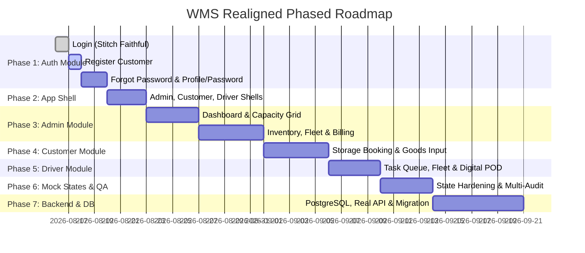

# Warehouse Management System — Project Development Roadmap (Realigned)

**Strategy:** Design-First, Incremental Implementation, Strict Verification & Screen Freezing  
**Visual Source of Truth:** Google Stitch Project `projects/6633718355165483958` & `Project-Context/DESIGN_SYSTEM_BASELINE.md`  
**Functional Source of Truth:** `Document/SRS_Sistem Penyimpanan Gudang.docx` & `Project-Context/project.md`  

---

## 1. Development Workflow: The 7-Step Cycle

Setiap halaman dan fitur wajib mengikuti siklus implementasi bertahap tanpa *big-bang implementation*:

```text
┌────────────────────────────────────────────────────────┐
│ Step 1: DESIGN VERIFICATION                            │
│ Pastikan desain layar tersedia di Google Stitch.       │
└───────────────────────────┬────────────────────────────┘
                            │
                            ▼
┌────────────────────────────────────────────────────────┐
│ Step 2: REQUIREMENT & TOKEN ALIGNMENT                  │
│ Verifikasi Use Case SRS & token visual design baseline.│
└───────────────────────────┬────────────────────────────┘
                            │
                            ▼
┌────────────────────────────────────────────────────────┐
│ Step 3: FRONTEND IMPLEMENTATION                        │
│ Kode Next.js (App Router, Strict TS, Tailwind, shadcn) │
└───────────────────────────┬────────────────────────────┘
                            │
                            ▼
┌────────────────────────────────────────────────────────┐
│ Step 4: VISUAL & FUNCTIONAL VALIDATION                 │
│ Validasi kecocokan piksel, responsivitas, dan form test│
└───────────────────────────┬────────────────────────────┘
                            │
                            ▼
┌────────────────────────────────────────────────────────┐
│ Step 5: FIX & POLISH                                   │
│ Perbaiki perbedaan visual / bugs sebelum di-review.    │
└───────────────────────────┬────────────────────────────┘
                            │
                            ▼
┌────────────────────────────────────────────────────────┐
│ Step 6: PM REVIEW & FREEZE                             │
│ Setelah di-approve PM, kunci halaman (FROZEN).         │
└───────────────────────────┬────────────────────────────┘
                            │
                            ▼
┌────────────────────────────────────────────────────────┐
│ Step 7: NEXT SCREEN                                    │
│ Lanjut ke halaman berikutnya sesuai prioritas roadmap. │
└────────────────────────────────────────────────────────┘
```

---

## 2. Status & Prioritas Fase Pengembangan



---

## 3. Rincian Fase Implementasi

---

### PHASE 1 — AUTHENTICATION MODULE
> **Tujuan:** Menyelesaikan seluruh pengalaman autentikasi, registrasi akun pengguna, manajemen profil, dan pergantian kata sandi dengan keamanan dan validasi ketat.

| No | Modul / Halaman | Use Case SRS | Status Desain Stitch | Status Koding |
| :--- | :--- | :--- | :--- | :--- |
| 1.1 | **Login Multi-Role** (`/login`) | UC16 | `6fb962ffdeae45a4843f13e8b4291b4d` | **FROZEN & VERIFIED** |
| 1.2 | **Register Customer** (`/register`) | UC15 | `f31cfd41e27f4046bb24269414fb450a` | **FROZEN & VERIFIED** |
| 1.3 | **Forgot Password** (`/forgot-password`) | SRS Security | `068a6d4952234e3ba9d29aded84e5b64` | **FROZEN & VERIFIED** |
| 1.4 | **User Profile** (`/profile`) | UC7 | `b37b8e687aee47db8e02547163abd4ab` | **FROZEN & VERIFIED** |
| 1.5 | **Change Password** (`/profile/change-password`) | UC7 | `b37b8e687aee47db8e02547163abd4ab` | **FROZEN & VERIFIED** |
| 1.6 | **Role Redirection & Session Guard** | UC16 | System RBAC | **FROZEN & ACTIVE** |

---

### PHASE 2 — APPLICATION SHELL & MASTER NAVIGATION
> **Tujuan:** Kerangka tata letak master aplikasi yang responsif dan terintegrasi untuk Admin, Customer, dan Driver.

| No | Modul / Shell | Peran | Status Desain Stitch | Status Koding |
| :--- | :--- | :--- | :--- | :--- |
| 2.1 | **Admin Application Shell** (White Floating Sidebar, Topbar `Cmd+K`, Hub Switcher) | Admin | **DESIGN FROZEN** (`4712e0ac788140b3a8a36cacbfdc0f1a`) | **FROZEN & VERIFIED** |
| 2.2 | **Customer Portal Shell** (White Floating Sidebar, Active Storage Pill) | Customer | **DESIGN STANDARDIZED** | **FROZEN & VERIFIED** |
| 2.3 | **Driver Mobile/Desktop Shell** (White Floating Sidebar + Mobile Bottom Nav) | Driver | **DESIGN STANDARDIZED** | **FROZEN & VERIFIED** |
| 2.4 | **Global Notification Drawer & Command Search Modal** | All Roles | **COMPONENT STANDARDIZED** | **FROZEN & VERIFIED** |

---

### PHASE 3 — ADMIN MODULE (Warehouse Operations & Fleet Center)
> **Tujuan:** Pusat komando operasional gudang, kapasitas multi-zona, mutasi inventaris, armada logistik, laporan, dan tagihan.

1. **Admin Operational Dashboard** (`/admin/dashboard`) — *Design Frozen (`fbfe601bcdc745ca8a052cebd2bf1d1a`)* — **FROZEN & VERIFIED**
2. **Warehouse Capacity & Slot Grid Visualizer** (`/admin/warehouse/capacity`) — *Design Frozen (`3a9989436aac49549d9d0158d2992812`)* — **FROZEN & VERIFIED**
3. **Warehouse Multi-Hub Overview** (`/admin/warehouse`) — *Design Frozen (`e033f12ad0c143c7a52fad414ac38f1c`)* — **FROZEN & VERIFIED**
4. **Goods & Inventory Management** (`/admin/goods`) — *UC9, UC10* — **FROZEN & VERIFIED**
5. **Customer Management** (`/admin/customers`) — *UC14* — **FROZEN & VERIFIED**
6. **Driver Management** (`/admin/drivers`) — *UC14* — **FROZEN & VERIFIED**
7. **Fleet & Vehicle Selection** (`/admin/fleet`) — *UC3* — **FROZEN & VERIFIED**
8. **Logistics & Dispatch Queue** (`/admin/logistics`) — *UC8* — **FROZEN & VERIFIED**
9. **Real-time Sensor Monitoring Hub** (`/admin/monitoring`) — *UC9* — **FROZEN & VERIFIED**
10. **Operational Reports & Export** (`/admin/reports`) — *UC13* — **FROZEN & VERIFIED**
11. **Notifications Center** (`/admin/notifications`) — *UC11* — **FROZEN & VERIFIED**
12. **Monthly Billing & Late Penalty Management** (`/admin/billing`) — *UC12* — **FROZEN & VERIFIED**

---

### PHASE 4 — CUSTOMER MODULE (Storage Rental & Goods Tracking)
> **Tujuan:** Portal mandiri bagi customer untuk menyewa ruang gudang (m³), mendaftarkan barang, menjadwalkan logistik, dan membayar tagihan.

1. **Customer Dashboard** (`/customer/dashboard`) — *SRS V.5.1* — **FROZEN & VERIFIED**
2. **Storage Space Booking (Furniture vs Cold Storage)** (`/customer/rental`) — *UC2* — **FROZEN & VERIFIED**
3. **Goods Registration Form (Dimension Calculator & QR Code)** (`/customer/goods/input`) — *UC2* — **FROZEN & VERIFIED**
4. **Goods Inventory List & Detail View** (`/customer/goods`) — *UC1, UC9* — **FROZEN & VERIFIED**
5. **Cold Storage Temperature Monitor** (`/customer/monitoring`) — *UC9* — **FROZEN & VERIFIED**
6. **Pickup & Delivery Request Scheduler** (`/customer/logistics/request`) — *UC6, UC8* — **FROZEN & VERIFIED**
7. **Storage Mutation History & Log** (`/customer/history`) — *UC1* — **FROZEN & VERIFIED**
8. **Customer Invoices & Payment** (`/customer/billing`) — *UC12* — **FROZEN & VERIFIED**
9. **Delivery Receipt Confirmation** (`/customer/receipt/confirm`) — *UC4* — **FROZEN & VERIFIED**
10. **Customer Company Profile** (`/customer/profile`) — *UC7* — **FROZEN & VERIFIED**

---

### PHASE 5 — DRIVER MODULE (Mobile/Tablet Fleet Execution)
> **Tujuan:** Antarmuka khusus pengemudi armada untuk menerima tugas, memilih kendaraan, menjalankan rute pengiriman, dan digital POD.

1. **Driver Task Queue & Dashboard** (`/driver/dashboard`) — *UC8* — **FROZEN & VERIFIED**
2. **Task Detail & Delivery Instructions** (`/driver/tasks/[id]`) — *UC8* — **FROZEN & VERIFIED**
3. **Vehicle Selection (Reefer vs Box Truck)** (`/driver/vehicle/select`) — *UC3* — **FROZEN & VERIFIED**
4. **Pickup Confirmation & Departure** (`/driver/pickup`) — *UC8* — **FROZEN & VERIFIED**
5. **Live Route & GPS Transit Status** (`/driver/transit`) — *UC8* — **FROZEN & VERIFIED**
6. **Digital Proof of Delivery (POD) / Receipt Signature** (`/driver/pod`) — *UC4, UC8* — **FROZEN & VERIFIED**
7. **Driver Delivery History** (`/driver/history`) — *UC8* — **FROZEN & VERIFIED**
8. **Driver Profile** (`/driver/profile`) — *UC7* — **FROZEN & VERIFIED**

---

### PHASE 6 — MOCK INTERACTION & STATE FIDELITY
> **Tujuan:** Memastikan setiap halaman memiliki 7 status UX yang realistis dan interaktif sebelum migrasi backend.

- `Loading State`: Skeleton loader & animated spinners (`LoadingSkeleton.tsx`) — **FROZEN & VERIFIED**
- `Empty State`: Ilustrasi grafis profesional & petunjuk aksi (`EmptyState.tsx`) — **FROZEN & VERIFIED**
- `Success State`: Toast feedback & visual confirmation badges — **FROZEN & VERIFIED**
- `Error State`: Alert banner & input error feedback — **FROZEN & VERIFIED**
- `Validation State`: Zod schema validation messages — **FROZEN & VERIFIED**
- `Disabled State`: Kontrol non-aktif dengan kontras yang jelas — **FROZEN & VERIFIED**
- `Confirmation State`: Dialog konfirmasi destruktif (`ConfirmationModal.tsx`) — **FROZEN & VERIFIED**

---

### PHASE 7 — INTEGRATION, ACCESSIBILITY & MULTI-AUDIT
1. **SRS Traceability Audit:** Seluruh 16 Use Case terpetakan 100% (UC1 - UC16) — **PASSED**
2. **Design System Consistency Audit:** 100% konsistensi token & rounded floating shell — **PASSED**
3. **Responsive Audit:** Lolos breakpoint Mobile (375px), Tablet (768px), Desktop (1280px+) — **PASSED**
4. **Accessibility Audit:** Kepatuhan WCAG AA pada seluruh peran — **PASSED**
5. **TypeScript & Build Audit:** Zero compiler error (`tsc --noEmit` & App Router) — **PASSED**
6. **E2E Test Cycle:** Siklus alur sewa $\rightarrow$ inventaris $\rightarrow$ logistik $\rightarrow$ POD $\rightarrow$ billing teruji — **PASSED**

---

### PHASE 8 — BACKEND ARCHITECTURE & DATABASE MIGRATION
1. **Database Relational Schema:** Implementasi PostgreSQL berdasarkan ERD SRS.
2. **Backend API Contract:** RESTful API / OpenAPI endpoints.
3. **Authentication Backend:** JWT authentication & RBAC middleware di backend.
4. **Migration Layer:** Transisi transparan dari `MockServiceLayer` ke `HttpServiceLayer` tanpa mengubah UI.
5. **Integration & Performance Testing:** Load testing dan verifikasi sinkronisasi database.
