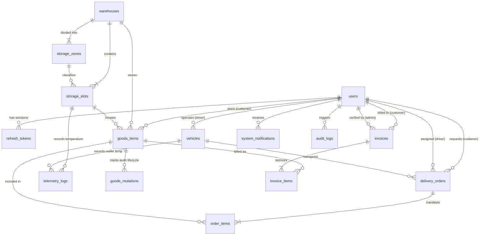

# DATABASE DOMAIN MODEL & RELATIONAL SPECIFICATION
**Warehouse Management System (WMS Nusantara)**
*Spesifikasi Lengkap Entity Domain Model, Tipe Data, Relasi, Constraint, dan Index Database PostgreSQL 16*

---

## 1. Ringkasan Eksekutif & Prinsip Desain Data

Database WMS Nusantara dirancang menggunakan **PostgreSQL 16** dan **Prisma ORM** dengan mematuhi prinsip:
1. **Third Normal Form (3NF) Compliance:** Menjamin integritas referensial dan mencegah anomali data (*insert/update/delete anomalies*).
2. **ACID Transactions:** Operasi kritis (seperti alokasi volume slot gudang, penerbitan invoice, dan verifikasi POD) dieksekusi dalam transaksi atomik database.
3. **Data Type Precision:**
   - **Monetary (Mata Uang IDR):** Menggunakan `DECIMAL(14, 2)` atau `BIGINT` untuk mencegah *floating-point rounding errors*.
   - **Volume & Dimensi ($m^3$, $cm$, $kg$):** Menggunakan `DECIMAL(10, 4)` dan `DECIMAL(10, 2)` untuk akurasi kubikasi presisi tinggi ($P \times L \times T / 10^6$).
   - **Temperatur ($^\circ\text{C}$):** Menggunakan `DECIMAL(5, 2)` untuk mendukung rentang suhu Cold Storage ($-25.00^\circ\text{C}$ s/d $-18.00^\circ\text{C}$).
4. **Client-Agnostic & Zero-Drift with Frontend:** Struktur relasi dan atribut data memetakan secara presisi seluruh kebutuhan use case SRS (UC1–UC16) dan model TypeScript frontend (`frontend/src/types/`).

---

## 2. Master Entity Summary Table

| Entity | Purpose / Deskripsi Domain | Primary Key | Important Relations (FK) | Source SRS & Frontend |
| :--- | :--- | :---: | :--- | :--- |
| **`User`** | Akun pengguna multi-peran (Admin, Customer, Driver) | `id` (UUID) | $\rightarrow$ `RefreshToken`, `GoodsItem`, `DeliveryOrder`, `Vehicle`, `Invoice`, `SystemNotification` | SRS UC15, UC16, UC7; `auth.types.ts` |
| **`RefreshToken`** | Hash token sesi aktif untuk rotasi token aman & revoke | `id` (UUID) | $\rightarrow$ `User` | Backend Security Architecture; ADR-004 |
| **`Warehouse`** | Master fasilitas fisik gudang multi-hub | `id` (UUID / Code) | $\rightarrow$ `StorageSlot`, `GoodsItem` | SRS UC2, UC9; `warehouse.types.ts` |
| **`StorageZone`** | Klasifikasi zona simpan (Standard, Cold Storage, Heavy Duty) | `id` (UUID) | $\rightarrow$ `Warehouse`, `StorageSlot` | SRS UC2, UC9; `warehouse.types.ts` |
| **`StorageSlot`** | Grid rak fisik 3D dan ruang simpan per gudang | `id` (UUID / Code) | $\rightarrow$ `Warehouse`, `StorageZone`, `GoodsItem`, `TelemetryLog` | SRS UC2, UC9; `warehouse.types.ts` |
| **`GoodsItem`** | Master inventaris SKU barang milik customer | `id` (UUID) | $\rightarrow$ `User` (Customer), `Warehouse`, `StorageSlot`, `GoodsMutation`, `OrderItem` | SRS UC2, UC9, UC10; `goods.types.ts` |
| **`GoodsMutation`** | Audit log kronologis perpindahan & status barang | `id` (UUID) | $\rightarrow$ `GoodsItem`, `User` (Actor) | SRS UC1; `goods.types.ts` (`history`) |
| **`Vehicle`** | Master armada truk pengangkutan (Reefer, Box, Van) | `id` (UUID) | $\rightarrow$ `User` (Assigned Driver), `DeliveryOrder`, `TelemetryLog` | SRS UC3; `logistics.types.ts` |
| **`DeliveryOrder`** | Surat jalan order logistik (Inbound Pickup & Outbound Delivery) | `id` (UUID) | $\rightarrow$ `User` (Customer), `User` (Driver), `Vehicle`, `OrderItem` | SRS UC4, UC6, UC8; `logistics.types.ts` |
| **`OrderItem`** | Relasi muatan manifest kargo barang per Delivery Order | `id` (UUID) | $\rightarrow$ `DeliveryOrder`, `GoodsItem` | Relational 3NF Junction; `logistics.types.ts` |
| **`Invoice`** | Faktur sewa bulanan ruang gudang & denda keterlambatan | `id` (UUID) | $\rightarrow$ `User` (Customer), `User` (Admin verifier), `InvoiceItem` | SRS UC11, UC12; `billing.types.ts` |
| **`InvoiceItem`** | Rincian breakdown kalkulasi sewa per SKU / slot barang | `id` (UUID) | $\rightarrow$ `Invoice`, `GoodsItem` (Optional) | SRS UC12; `billing.types.ts` |
| **`TelemetryLog`** | Log pencatatan berkala IoT sensor suhu & kelembaban | `id` (UUID) | $\rightarrow$ `StorageSlot` (Optional), `Vehicle` (Optional) | SRS UC9; ADR-006 |
| **`SystemNotification`** | Notifikasi in-app & alert operasional real-time | `id` (UUID) | $\rightarrow$ `User` (Recipient) | SRS UC11; `notification.types.ts` |
| **`AuditLog`** | Jejak audit keamanan untuk compliance & mutasi sensitif | `id` (UUID) | $\rightarrow$ `User` (Optional Actor) | Backend Governance; SRS III.2.1 |

---

## 3. Detail Spesifikasi 15 Entitas Relasional

---

### 3.1 Entity: `User` (`users`)
- **Deskripsi:** Menyimpan profil dan kredensial seluruh pengguna sistem dengan pembedaan peran (*Role-Based*).
- **Primary Key:** `id` (UUID v4 / CUID, String).
- **Atribut & Tipe Data:**
  - `id`: `VARCHAR(36)` / `UUID` — PK
  - `name`: `VARCHAR(100)` — NOT NULL
  - `email`: `VARCHAR(150)` — UNIQUE, NOT NULL
  - `password_hash`: `VARCHAR(255)` — NOT NULL
  - `role`: `ENUM('ADMIN', 'CUSTOMER', 'DRIVER')` — NOT NULL, DEFAULT `'CUSTOMER'`
  - `phone`: `VARCHAR(20)` — NOT NULL
  - `avatar_url`: `TEXT` — NULLABLE
  - `company_name`: `VARCHAR(150)` — NULLABLE (Wajib untuk Customer)
  - `address`: `TEXT` — NULLABLE (Alamat kantor/operasional)
  - `driver_license_number`: `VARCHAR(50)` — NULLABLE (Nomor SIM B2 untuk Driver)
  - `driver_license_expiry`: `DATE` — NULLABLE
  - `status`: `ENUM('ACTIVE', 'SUSPENDED', 'PENDING_VERIFICATION')` — NOT NULL, DEFAULT `'ACTIVE'`
  - `created_at`: `TIMESTAMPTZ` — DEFAULT `NOW()`
  - `updated_at`: `TIMESTAMPTZ` — AUTO-UPDATE
- **Constraints & Indexes:**
  - `UNIQUE(email)`
  - `INDEX idx_users_role (role)`
  - `INDEX idx_users_status (status)`

---

### 3.2 Entity: `RefreshToken` (`refresh_tokens`)
- **Deskripsi:** Menyimpan hash refresh token yang sah untuk rotasi token aman dan pembatalan sesi (*revocation*).
- **Primary Key:** `id` (UUID).
- **Atribut & Tipe Data:**
  - `id`: `UUID` — PK
  - `user_id`: `UUID` — FK $\rightarrow$ `users.id` (ON DELETE CASCADE)
  - `token_hash`: `VARCHAR(255)` — NOT NULL
  - `is_revoked`: `BOOLEAN` — DEFAULT `FALSE`
  - `expires_at`: `TIMESTAMPTZ` — NOT NULL
  - `created_at`: `TIMESTAMPTZ` — DEFAULT `NOW()`
- **Constraints & Indexes:**
  - `INDEX idx_refresh_tokens_user_id (user_id)`
  - `INDEX idx_refresh_tokens_expires_at (expires_at)`

---

### 3.3 Entity: `Warehouse` (`warehouses`)
- **Deskripsi:** Master fasilitas gudang multi-cabang (Hub Cakung, Gedebage, dll.).
- **Primary Key:** `id` (UUID).
- **Atribut & Tipe Data:**
  - `id`: `VARCHAR(36)` / `UUID` — PK
  - `code`: `VARCHAR(30)` — UNIQUE, NOT NULL (e.g. `'WH-CKG-01'`, `'WH-BDG-01'`)
  - `name`: `VARCHAR(150)` — NOT NULL
  - `address`: `TEXT` — NOT NULL
  - `city`: `VARCHAR(100)` — NOT NULL
  - `total_capacity_m3`: `DECIMAL(10, 2)` — NOT NULL
  - `used_capacity_m3`: `DECIMAL(10, 2)` — DEFAULT `0.00`
  - `is_active`: `BOOLEAN` — DEFAULT `TRUE`
  - `manager_name`: `VARCHAR(100)` — NOT NULL
  - `contact_phone`: `VARCHAR(30)` — NOT NULL
  - `created_at`: `TIMESTAMPTZ` — DEFAULT `NOW()`
  - `updated_at`: `TIMESTAMPTZ` — AUTO-UPDATE
- **Constraints & Indexes:**
  - `UNIQUE(code)`
  - `INDEX idx_warehouses_city (city)`
  - `INDEX idx_warehouses_is_active (is_active)`

---

### 3.4 Entity: `StorageZone` (`storage_zones`)
- **Deskripsi:** Segmentasi zona penyimpanan spesifik di dalam gudang (Standar, Suhu Beku Cold Storage, Rak Beban Berat).
- **Primary Key:** `id` (UUID).
- **Atribut & Tipe Data:**
  - `id`: `UUID` — PK
  - `warehouse_id`: `UUID` — FK $\rightarrow$ `warehouses.id` (ON DELETE CASCADE)
  - `name`: `VARCHAR(100)` — NOT NULL (e.g. `'Zona Cold Storage A'`, `'Zona Standar Lantai 1'`)
  - `type`: `ENUM('STANDARD', 'COLD_STORAGE', 'HEAVY_DUTY')` — NOT NULL
  - `capacity_m3`: `DECIMAL(10, 2)` — NOT NULL
  - `used_m3`: `DECIMAL(10, 2)` — DEFAULT `0.00`
  - `target_temp_min`: `DECIMAL(5, 2)` — NULLABLE (e.g. `-25.00` untuk Cold)
  - `target_temp_max`: `DECIMAL(5, 2)` — NULLABLE (e.g. `-18.00` untuk Cold)
  - `created_at`: `TIMESTAMPTZ` — DEFAULT `NOW()`
- **Constraints & Indexes:**
  - `INDEX idx_storage_zones_warehouse (warehouse_id)`
  - `INDEX idx_storage_zones_type (type)`

---

### 3.5 Entity: `StorageSlot` (`storage_slots`)
- **Deskripsi:** Unit grid ruang/rak simpan fisik (misal: `COLD-A01`, `RAK-F01`) yang dapat divisualisasikan dalam UI 3D.
- **Primary Key:** `id` (UUID / Code).
- **Atribut & Tipe Data:**
  - `id`: `VARCHAR(36)` / `UUID` — PK
  - `warehouse_id`: `UUID` — FK $\rightarrow$ `warehouses.id` (ON DELETE RESTRICT)
  - `zone_id`: `UUID` — FK $\rightarrow$ `storage_zones.id` (ON DELETE RESTRICT, NULLABLE untuk backwards compatibility)
  - `code`: `VARCHAR(30)` — NOT NULL (e.g. `'COLD-A01'`, `'RAK-F01'`)
  - `zone`: `ENUM('STANDARD', 'COLD_STORAGE', 'HEAVY_DUTY')` — NOT NULL
  - `capacity_m3`: `DECIMAL(10, 2)` — NOT NULL
  - `used_m3`: `DECIMAL(10, 2)` — DEFAULT `0.00`
  - `temperature_celsius`: `DECIMAL(5, 2)` — NULLABLE (Suhu sensor terkini)
  - `humidity_percent`: `DECIMAL(5, 2)` — NULLABLE (Kelembaban terkini)
  - `status`: `ENUM('AVAILABLE', 'OCCUPIED', 'RESERVED', 'MAINTENANCE')` — NOT NULL, DEFAULT `'AVAILABLE'`
  - `created_at`: `TIMESTAMPTZ` — DEFAULT `NOW()`
  - `updated_at`: `TIMESTAMPTZ` — AUTO-UPDATE
- **Constraints & Indexes:**
  - `UNIQUE(warehouse_id, code)` — Tidak boleh ada kode rak duplikat di gudang yang sama
  - `INDEX idx_storage_slots_warehouse_status (warehouse_id, status)`
  - `INDEX idx_storage_slots_zone (zone)`

---

### 3.6 Entity: `GoodsItem` (`goods_items`)
- **Deskripsi:** Master SKU barang milik customer yang disimpan di gudang.
- **Primary Key:** `id` (UUID).
- **Atribut & Tipe Data:**
  - `id`: `VARCHAR(36)` / `UUID` — PK
  - `barcode`: `VARCHAR(50)` — UNIQUE, NOT NULL (e.g. `'BRG-2026-FROZEN-001'`)
  - `customer_id`: `UUID` — FK $\rightarrow$ `users.id` (ON DELETE RESTRICT)
  - `warehouse_id`: `UUID` — FK $\rightarrow$ `warehouses.id` (ON DELETE RESTRICT)
  - `slot_id`: `VARCHAR(36)` / `UUID` — FK $\rightarrow$ `storage_slots.id` (NULLABLE, ON DELETE SET NULL)
  - `name`: `VARCHAR(200)` — NOT NULL
  - `category`: `ENUM('FURNITURE', 'COLD_FOOD', 'GENERAL_ELECTRONICS', 'TEXTILE')` — NOT NULL
  - `description`: `TEXT` — NOT NULL
  - `length_cm`: `DECIMAL(10, 2)` — NOT NULL
  - `width_cm`: `DECIMAL(10, 2)` — NOT NULL
  - `height_cm`: `DECIMAL(10, 2)` — NOT NULL
  - `volume_m3`: `DECIMAL(10, 4)` — NOT NULL ($P \times L \times T / 10^6 \times Qty$)
  - `weight_kg`: `DECIMAL(10, 2)` — NOT NULL
  - `quantity`: `INTEGER` — NOT NULL, DEFAULT `1`
  - `unit`: `VARCHAR(50)` — NOT NULL (e.g. `'Master Box'`, `'Pallet'`, `'Pcs'`)
  - `requires_cold_storage`: `BOOLEAN` — DEFAULT `FALSE`
  - `target_temp_min`: `DECIMAL(5, 2)` — NULLABLE
  - `target_temp_max`: `DECIMAL(5, 2)` — NULLABLE
  - `current_temp`: `DECIMAL(5, 2)` — NULLABLE
  - `storage_start_date`: `TIMESTAMPTZ` — NOT NULL
  - `storage_end_date`: `TIMESTAMPTZ` — NULLABLE
  - `monthly_rental_fee`: `DECIMAL(14, 2)` — NOT NULL
  - `status`: `ENUM('DRAFT', 'PENDING_PICKUP', 'IN_TRANSIT_INBOUND', 'INSPECTING', 'STORED', 'PENDING_DELIVERY', 'IN_TRANSIT_OUTBOUND', 'DELIVERED', 'CANCELLED')` — NOT NULL, DEFAULT `'DRAFT'`
  - `image_url`: `TEXT` — NULLABLE
  - `qr_code_data`: `TEXT` — NOT NULL (Format: `WMS://ITEM/<id>?code=<barcode>`)
  - `created_at`: `TIMESTAMPTZ` — DEFAULT `NOW()`
  - `updated_at`: `TIMESTAMPTZ` — AUTO-UPDATE
- **Constraints & Indexes:**
  - `UNIQUE(barcode)`
  - `INDEX idx_goods_customer (customer_id)`
  - `INDEX idx_goods_warehouse_status (warehouse_id, status)`
  - `INDEX idx_goods_slot (slot_id)`
  - `INDEX idx_goods_category (category)`

---

### 3.7 Entity: `GoodsMutation` (`goods_mutations`)
- **Deskripsi:** Catatan kronologis riwayat pergerakan dan mutasi status barang (Audit Lifecycle).
- **Primary Key:** `id` (UUID).
- **Atribut & Tipe Data:**
  - `id`: `UUID` — PK
  - `goods_id`: `UUID` — FK $\rightarrow$ `goods_items.id` (ON DELETE CASCADE)
  - `status`: `ENUM(GoodsStorageStatus)` — NOT NULL
  - `title`: `VARCHAR(150)` — NOT NULL
  - `description`: `TEXT` — NOT NULL
  - `actor_id`: `UUID` — FK $\rightarrow$ `users.id` (NULLABLE, ON DELETE SET NULL)
  - `actor_name`: `VARCHAR(100)` — NOT NULL
  - `actor_role`: `VARCHAR(50)` — NOT NULL
  - `location`: `VARCHAR(150)` — NULLABLE (e.g. `'Slot COLD-A01'`, `'Pelabuhan Muara Baru'`)
  - `timestamp`: `TIMESTAMPTZ` — DEFAULT `NOW()`
- **Constraints & Indexes:**
  - `INDEX idx_goods_mutations_goods_id (goods_id)`
  - `INDEX idx_goods_mutations_timestamp (timestamp)`

---

### 3.8 Entity: `Vehicle` (`vehicles`)
- **Deskripsi:** Master data armada logistik gudang (Truk Box, Truk Reefer Cold Chain, Van).
- **Primary Key:** `id` (UUID).
- **Atribut & Tipe Data:**
  - `id`: `VARCHAR(36)` / `UUID` — PK
  - `plate_number`: `VARCHAR(20)` — UNIQUE, NOT NULL (e.g. `'B 9821 WMS'`)
  - `name`: `VARCHAR(100)` — NOT NULL (e.g. `'Isuzu Giga Reefer Cold Truck 5T'`)
  - `type`: `ENUM('VAN', 'BOX_TRUCK_SMALL', 'REEFER_TRUCK', 'WING_BOX_LARGE')` — NOT NULL
  - `max_weight_kg`: `DECIMAL(10, 2)` — NOT NULL
  - `max_volume_m3`: `DECIMAL(10, 2)` — NOT NULL
  - `has_refrigeration`: `BOOLEAN` — DEFAULT `FALSE`
  - `min_temp_celsius`: `DECIMAL(5, 2)` — NULLABLE (e.g. `-25.00` untuk reefer)
  - `status`: `ENUM('AVAILABLE', 'IN_SERVICE', 'MAINTENANCE')` — NOT NULL, DEFAULT `'AVAILABLE'`
  - `current_driver_id`: `UUID` — FK $\rightarrow$ `users.id` (NULLABLE, ON DELETE SET NULL)
  - `location_city`: `VARCHAR(100)` — NOT NULL
  - `created_at`: `TIMESTAMPTZ` — DEFAULT `NOW()`
  - `updated_at`: `TIMESTAMPTZ` — AUTO-UPDATE
- **Constraints & Indexes:**
  - `UNIQUE(plate_number)`
  - `INDEX idx_vehicles_type_status (type, status)`
  - `INDEX idx_vehicles_driver (current_driver_id)`

---

### 3.9 Entity: `DeliveryOrder` (`delivery_orders`)
- **Deskripsi:** Surat Jalan / Order Logistik untuk penjemputan (*Inbound Pickup*) atau pengantaran (*Outbound Delivery*).
- **Primary Key:** `id` (UUID).
- **Atribut & Tipe Data:**
  - `id`: `VARCHAR(36)` / `UUID` — PK
  - `order_number`: `VARCHAR(50)` — UNIQUE, NOT NULL (e.g. `'ORD-2026-0814-01'`)
  - `type`: `ENUM('PICKUP', 'DELIVERY')` — NOT NULL
  - `customer_id`: `UUID` — FK $\rightarrow$ `users.id` (ON DELETE RESTRICT)
  - `driver_id`: `UUID` — FK $\rightarrow$ `users.id` (NULLABLE, ON DELETE SET NULL)
  - `vehicle_id`: `UUID` — FK $\rightarrow$ `vehicles.id` (NULLABLE, ON DELETE SET NULL)
  - `goods_summary`: `TEXT` — NOT NULL (Deskripsi ringkas muatan)
  - `total_volume_m3`: `DECIMAL(10, 4)` — NOT NULL
  - `total_weight_kg`: `DECIMAL(10, 2)` — NOT NULL
  - `requires_reefer`: `BOOLEAN` — DEFAULT `FALSE`
  - `origin_address`: `TEXT` — NOT NULL
  - `origin_city`: `VARCHAR(100)` — NOT NULL
  - `destination_address`: `TEXT` — NOT NULL
  - `destination_city`: `VARCHAR(100)` — NOT NULL
  - `scheduled_date`: `DATE` — NOT NULL
  - `scheduled_time_slot`: `VARCHAR(50)` — NOT NULL (e.g. `'14:00 - 17:00'`)
  - `status`: `ENUM('PENDING_ASSIGNMENT', 'DRIVER_ASSIGNED', 'EN_ROUTE_PICKUP', 'PICKED_UP', 'IN_TRANSIT', 'ARRIVED_DESTINATION', 'DELIVERED', 'CONFIRMED', 'DELAYED', 'CANCELLED')` — NOT NULL, DEFAULT `'PENDING_ASSIGNMENT'`
  - `estimated_duration_mins`: `INTEGER` — DEFAULT `0`
  - `distance_km`: `DECIMAL(8, 2)` — DEFAULT `0.00`
  - `is_delayed`: `BOOLEAN` — DEFAULT `FALSE`
  - `delay_reason`: `TEXT` — NULLABLE
  - `rescheduled_time`: `TIMESTAMPTZ` — NULLABLE
  - `proof_of_delivery_url`: `TEXT` — NULLABLE (Digital POD image in S3)
  - `recipient_name`: `VARCHAR(100)` — NULLABLE
  - `recipient_signature`: `TEXT` — NULLABLE (Base64/URL e-signature)
  - `driver_rating`: `DECIMAL(3, 2)` — NULLABLE ($1.00 - 5.00$)
  - `confirmed_by_customer`: `BOOLEAN` — DEFAULT `FALSE`
  - `confirmed_by_driver`: `BOOLEAN` — DEFAULT `FALSE`
  - `confirmed_by_admin`: `BOOLEAN` — DEFAULT `FALSE`
  - `confirmed_at`: `TIMESTAMPTZ` — NULLABLE
  - `created_at`: `TIMESTAMPTZ` — DEFAULT `NOW()`
  - `updated_at`: `TIMESTAMPTZ` — AUTO-UPDATE
- **Constraints & Indexes:**
  - `UNIQUE(order_number)`
  - `INDEX idx_orders_customer (customer_id)`
  - `INDEX idx_orders_driver_status (driver_id, status)`
  - `INDEX idx_orders_scheduled_date (scheduled_date)`

---

### 3.10 Entity: `OrderItem` (`order_items`)
- **Deskripsi:** Junction table Many-to-Many antara `DeliveryOrder` dan `GoodsItem` untuk melacak SKU yang dimuat dalam suatu order pengiriman.
- **Primary Key:** `id` (UUID).
- **Atribut & Tipe Data:**
  - `id`: `UUID` — PK
  - `order_id`: `UUID` — FK $\rightarrow$ `delivery_orders.id` (ON DELETE CASCADE)
  - `goods_id`: `UUID` — FK $\rightarrow$ `goods_items.id` (ON DELETE RESTRICT)
  - `quantity`: `INTEGER` — NOT NULL, DEFAULT `1`
  - `created_at`: `TIMESTAMPTZ` — DEFAULT `NOW()`
- **Constraints & Indexes:**
  - `UNIQUE(order_id, goods_id)` — Mencegah duplikasi SKU pada order yang sama
  - `INDEX idx_order_items_goods (goods_id)`

---

### 3.11 Entity: `Invoice` (`invoices`)
- **Deskripsi:** Faktur penagihan sewa ruang gudang bulanan tenant dan denda keterlambatan pembayaran ($5\%/\text{minggu}$).
- **Primary Key:** `id` (UUID).
- **Atribut & Tipe Data:**
  - `id`: `VARCHAR(36)` / `UUID` — PK
  - `invoice_number`: `VARCHAR(50)` — UNIQUE, NOT NULL (e.g. `'INV-2026-08-001'`)
  - `customer_id`: `UUID` — FK $\rightarrow$ `users.id` (ON DELETE RESTRICT)
  - `billing_month`: `VARCHAR(50)` — NOT NULL (e.g. `'Agustus 2026'`)
  - `issue_date`: `TIMESTAMPTZ` — NOT NULL
  - `due_date`: `TIMESTAMPTZ` — NOT NULL
  - `paid_date`: `TIMESTAMPTZ` — NULLABLE
  - `subtotal`: `DECIMAL(14, 2)` — NOT NULL
  - `penalty_fee`: `DECIMAL(14, 2)` — NOT NULL, DEFAULT `0.00`
  - `total_amount`: `DECIMAL(14, 2)` — NOT NULL
  - `status`: `ENUM('UNPAID', 'PENDING_VERIFICATION', 'PAID', 'OVERDUE', 'CANCELLED')` — NOT NULL, DEFAULT `'UNPAID'`
  - `payment_method`: `ENUM('BANK_TRANSFER', 'QRIS', 'VIRTUAL_ACCOUNT')` — NULLABLE
  - `payment_proof_url`: `TEXT` — NULLABLE (Bukti transfer di S3)
  - `verified_by_admin_id`: `UUID` — FK $\rightarrow$ `users.id` (NULLABLE, ON DELETE SET NULL)
  - `verified_at`: `TIMESTAMPTZ` — NULLABLE
  - `created_at`: `TIMESTAMPTZ` — DEFAULT `NOW()`
  - `updated_at`: `TIMESTAMPTZ` — AUTO-UPDATE
- **Constraints & Indexes:**
  - `UNIQUE(invoice_number)`
  - `INDEX idx_invoices_customer_status (customer_id, status)`
  - `INDEX idx_invoices_due_date (due_date)`

---

### 3.12 Entity: `InvoiceItem` (`invoice_items`)
- **Deskripsi:** Rincian pos tagihan sewa per volume barang ($m^3$) atau biaya operasional tambahan.
- **Primary Key:** `id` (UUID).
- **Atribut & Tipe Data:**
  - `id`: `VARCHAR(36)` / `UUID` — PK
  - `invoice_id`: `UUID` — FK $\rightarrow$ `invoices.id` (ON DELETE CASCADE)
  - `goods_id`: `UUID` — FK $\rightarrow$ `goods_items.id` (NULLABLE, ON DELETE SET NULL)
  - `description`: `VARCHAR(255)` — NOT NULL
  - `goods_name`: `VARCHAR(200)` — NULLABLE
  - `volume_m3`: `DECIMAL(10, 4)` — NOT NULL
  - `rate_per_m3`: `DECIMAL(14, 2)` — NOT NULL
  - `subtotal`: `DECIMAL(14, 2)` — NOT NULL
  - `created_at`: `TIMESTAMPTZ` — DEFAULT `NOW()`
- **Constraints & Indexes:**
  - `INDEX idx_invoice_items_invoice (invoice_id)`

---

### 3.13 Entity: `TelemetryLog` (`telemetry_logs`)
- **Deskripsi:** Time-series ingestion log dari sensor suhu & kelembaban IoT pada slot Cold Storage dan truk pendingin Reefer.
- **Primary Key:** `id` (UUID / BIGSERIAL).
- **Atribut & Tipe Data:**
  - `id`: `BIGSERIAL` / `UUID` — PK
  - `slot_id`: `VARCHAR(36)` / `UUID` — FK $\rightarrow$ `storage_slots.id` (NULLABLE, ON DELETE CASCADE)
  - `vehicle_id`: `VARCHAR(36)` / `UUID` — FK $\rightarrow$ `vehicles.id` (NULLABLE, ON DELETE CASCADE)
  - `temperature_celsius`: `DECIMAL(5, 2)` — NOT NULL
  - `humidity_percent`: `DECIMAL(5, 2)` — NULLABLE
  - `is_anomaly`: `BOOLEAN` — DEFAULT `FALSE` (True jika suhu $> -16.0^\circ\text{C}$ pada cold storage)
  - `recorded_at`: `TIMESTAMPTZ` — NOT NULL, DEFAULT `NOW()`
- **Constraints & Indexes:**
  - `INDEX idx_telemetry_slot_time (slot_id, recorded_at DESC)`
  - `INDEX idx_telemetry_vehicle_time (vehicle_id, recorded_at DESC)`
  - `INDEX idx_telemetry_anomaly (is_anomaly)`

---

### 3.14 Entity: `SystemNotification` (`system_notifications`)
- **Deskripsi:** Notifikasi in-app untuk Admin, Customer, dan Driver terkait perubahan status sewa, tagihan, dan dispatch order.
- **Primary Key:** `id` (UUID).
- **Atribut & Tipe Data:**
  - `id`: `VARCHAR(36)` / `UUID` — PK
  - `recipient_user_id`: `UUID` — FK $\rightarrow$ `users.id` (ON DELETE CASCADE)
  - `recipient_role`: `ENUM('ADMIN', 'CUSTOMER', 'DRIVER')` — NOT NULL
  - `title`: `VARCHAR(150)` — NOT NULL
  - `message`: `TEXT` — NOT NULL
  - `category`: `ENUM('BILLING_DUE', 'PAYMENT_RECEIVED', 'GOODS_STORED', 'GOODS_INSPECTED', 'DRIVER_DISPATCHED', 'DELIVERY_ARRIVED', 'SCHEDULE_DELAY', 'CONFIRMATION_REQUIRED')` — NOT NULL
  - `related_entity_id`: `VARCHAR(100)` — NULLABLE
  - `related_entity_type`: `ENUM('GOODS', 'ORDER', 'INVOICE', 'WAREHOUSE')` — NULLABLE
  - `is_read`: `BOOLEAN` — DEFAULT `FALSE`
  - `action_url`: `VARCHAR(255)` — NULLABLE
  - `created_at`: `TIMESTAMPTZ` — DEFAULT `NOW()`
- **Constraints & Indexes:**
  - `INDEX idx_notifications_recipient_read (recipient_user_id, is_read)`
  - `INDEX idx_notifications_created_at (created_at DESC)`

---

### 3.15 Entity: `AuditLog` (`audit_logs`)
- **Deskripsi:** Jejak audit mutasi data sensitif (pembuatan user, pembatalan invoice, perubahan slot rak).
- **Primary Key:** `id` (UUID).
- **Atribut & Tipe Data:**
  - `id`: `UUID` — PK
  - `actor_id`: `UUID` — FK $\rightarrow$ `users.id` (NULLABLE, ON DELETE SET NULL)
  - `action`: `VARCHAR(100)` — NOT NULL (e.g. `'USER_CREATED'`, `'INVOICE_PAID'`, `'SLOT_MAINTENANCE'`)
  - `entity_type`: `VARCHAR(50)` — NOT NULL (e.g. `'User'`, `'Invoice'`, `'StorageSlot'`)
  - `entity_id`: `VARCHAR(100)` — NOT NULL
  - `old_values`: `JSONB` — NULLABLE
  - `new_values`: `JSONB` — NULLABLE
  - `ip_address`: `VARCHAR(45)` — NULLABLE
  - `created_at`: `TIMESTAMPTZ` — DEFAULT `NOW()`
- **Constraints & Indexes:**
  - `INDEX idx_audit_entity (entity_type, entity_id)`
  - `INDEX idx_audit_actor (actor_id)`
  - `INDEX idx_audit_created_at (created_at DESC)`

---

## 4. Entity-Relationship Diagram (ERD) Visualisasi

---

## 5. Business Rules & Database Constraints

1. **Aturan Perhitungan Volume Barang ($m^3$):**
   $$\text{volumeM3} = \frac{\text{lengthCm} \times \text{widthCm} \times \text{heightCm}}{1\,000\,000} \times \text{quantity}$$
   *Constraint DB:* `CHECK (length_cm > 0 AND width_cm > 0 AND height_cm > 0 AND quantity > 0)`.

2. **Aturan Denda Keterlambatan Pembayaran (SRS UC12 & UC11):**
   - Jika $\text{currentDate} > \text{dueDate}$, status invoice berubah menjadi `'OVERDUE'`.
   - Denda dihitung $5\%$ per minggu keterlambatan:
     $$\text{penaltyFee} = \text{subtotal} \times 0.05 \times \lceil \text{weeksOverdue} \rceil$$
   *Constraint DB:* `CHECK (penalty_fee >= 0 AND total_amount >= subtotal)`.

3. **Aturan Cold Chain Storage & Monitoring (SRS UC9):**
   - Jika `requires_cold_storage = TRUE`, maka `slot.zone` wajib `'COLD_STORAGE'`.
   - Jika barang dingin dimasukkan ke armada, `vehicle.type` wajib `'REEFER_TRUCK'` (`has_refrigeration = TRUE`).
   - Ambang batas anomali suhu: jika suhu $\text{celsius} > -16.0^\circ\text{C}$, trigger status `is_anomaly = TRUE` pada `telemetry_logs`.

4. **Aturan Validasi Kapasitas Slot Fisik:**
   $$\sum \text{goods.volumeM3} \le \text{slot.capacityM3}$$
   Jika kapasitas terlampaui, status slot otomatis berubah menjadi `'OCCUPIED'`.

5. **Aturan Digital Proof of Delivery (SRS UC4):**
   - Suatu order pengiriman selesai (`status = 'DELIVERED'`) apabila `confirmed_by_customer = TRUE` dan `proof_of_delivery_url` telah terisi di object storage MinIO.
